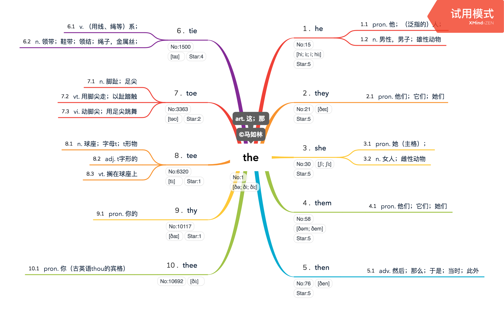

# 马如林记单词1 - The

阅读提示：

* 点击图片，放大缩小或横屏查看。
* 相关单词都是通过核心词，进行一个简单变化的扩展。
  * the-&gt;he：the去掉t，变成he。
  * the-&gt;they：the添加y，变成they。
  * the-&gt;she：the第1个t替换成s，变成she。
  * 以此类推。
* No是词频排序，n表示第n个，越低出现概率越高。
* Star是柯林斯字典的星级，包含5，4，3，2，1五个，越高越重要。

the No:1, \[ðə; ði; ðiː\], Star:5art. 这；那 

1 . he No:15, \[hi; iː; i; hiː\], Star:5

    1.1 pron. 他；（泛指的）人；

    1.2 n. 男性，男子；雄性动物

2 . they No:21, \[ðeɪ\], Star:5

    2.1 pron. 他们；它们；她们

3 . she No:30, \[ʃi; ʃiː\], Star:5

    3.1 pron. 她（主格）；

    3.2 n. 女人；雌性动物

4 . them No:58, \[ðəm; ðem\], Star:5

    4.1 pron. 他们；它们；她们

5 . then No:76, \[ðen\], Star:5

    5.1 adv. 然后；那么；于是；当时；此外

6 . tie No:1500, \[taɪ\], Star:4

    6.1 v. （用线、绳等）系；

    6.2 n. 领带；鞋带；领结；绳子，金属丝；

7 . toe No:3363, \[təʊ\], Star:2

    7.1 n. 脚趾；足尖

    7.2 vt. 用脚尖走；以趾踏触

    7.3 vi. 动脚尖；用足尖跳舞

8 . tee No:6320, \[tiː\], Star:1

    8.1 n. 球座；字母t；t形物

    8.2 adj. t字形的

    8.3 vt. 搁在球座上

9 . thy No:10117, \[ðaɪ\], Star:1 

    9.1 pron. 你的

10 . thee No:10692, \[ðiː\] 

    10.1 pron. 你（古英语thou的宾格）

个人建议选择一万个以下的记忆即可，考GRE，TOFEL，雅思高分追求者，专八等除外。

